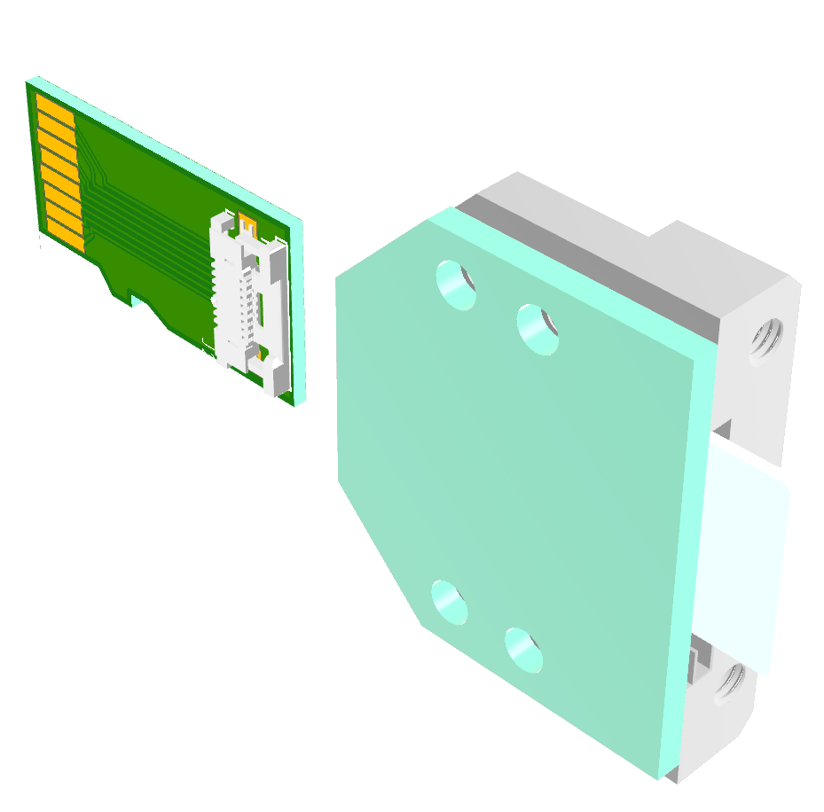
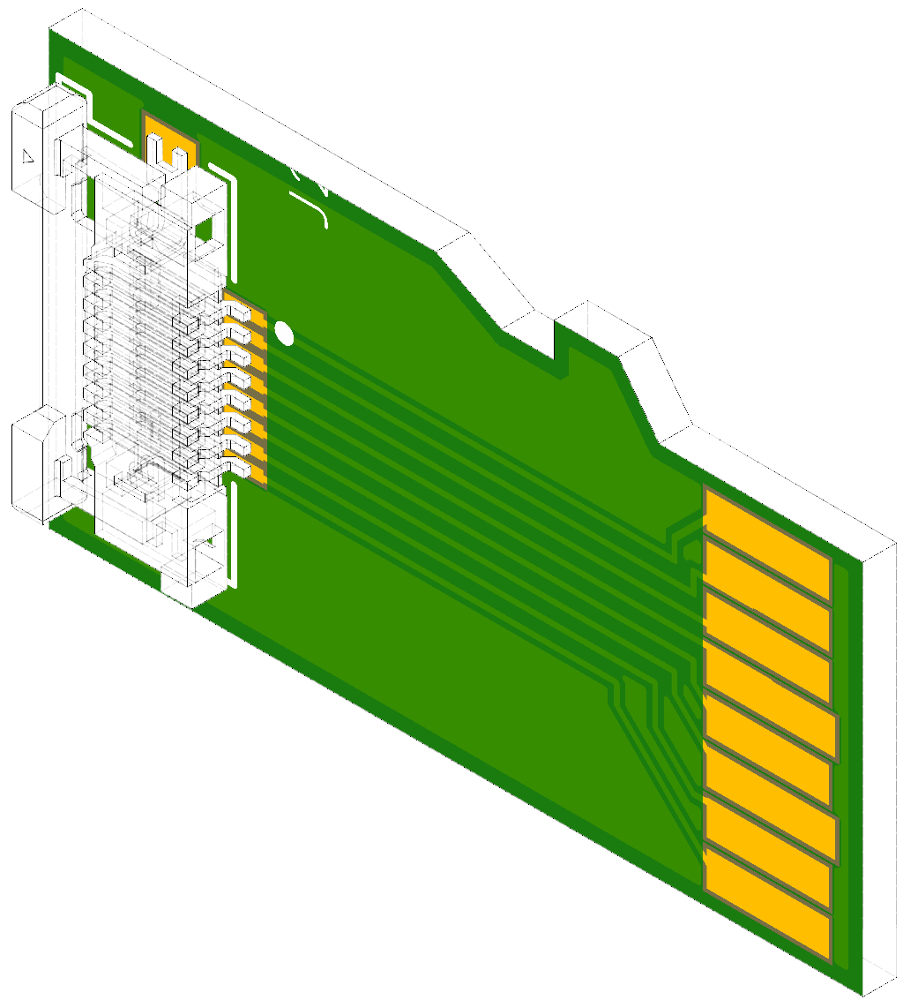
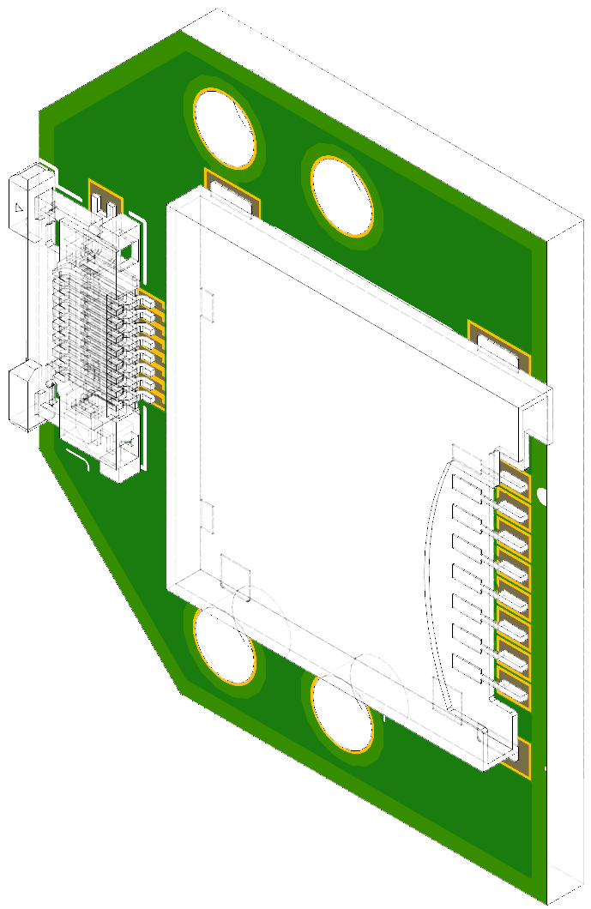

# sd-micro panel-mount breakout/extender
* panel-mount micro-sd breakout/extension diy project
  * panel-mount pc-board for micro sd-card female to 0.5mm ffc/fpc connector
  * micro-sd form-factor pcb with 0.5mm ffc/fpc connector, 
    * connect to panel board via 8-pin 0.5mm opposite-side-conductors ffc cable; 
    * ideally pcb thickness should be 0.6mm but this makes pcb expensive (currently trying 1.0mm, 0.8mm)
  
## warning: untested concept work-in-progress, use with caution...
# circuit hub
* [sd-card-extender-male](https://circuithub.com/projects/newdigate/sd-card-extender-male/revisions/17839)
* [sd-card-extender](https://circuithub.com/projects/newdigate/sd-card-extender/revisions/17837)

